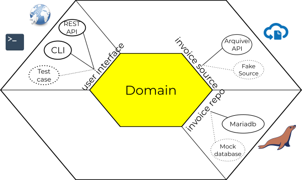

# Bolton Challenge

## Getting started

This project is a solution for the bolton backed challenge at Arquivei.

The goal is integrating with Arquivei's API to fetch a list of
electronic invoices in XML format and populate a relational database with
information from the electronic invoices. Also, provide an api endpoint to consume
the saved data.

This project provides a `docker-compose.yaml` file for convenience, so if you don't have 
`docker` and `docker-compose` installed, got get them. Then, simply run:

    make setup
    
This will set up the containers, install the dependencies, run the quality checks
and automated tests and also create the `.env.local` file. Open this file, and update it
with Arquivei's API credentials:

    ARQUIVEI_API_ID=<put-api-id-here>
    ARQUIVEI_API_KEY=<put-api-key-here>
    
Now we can sync the local database with the electronic invoices returned by
Arquivei's API:

    make sync
    
After the syncing is done we can fetch information about any of the imported invoices:

    curl -X GET http://localhost:8080/api/invoice/<invoice-access-key>    
    
This will give you a json similar to the following:

````json
{
  "access_key": "727272727272727272727",
  "value": 422.34
}
````

## Technical details

### Architecture



The challenge was solved by applying the hexagonal architecture. During the modelling
phase, 3 ports were identified:

 1. *User Interface:* This port is for interacting with the application
 2. *Repository:* This port is for storing and fetching invoice data
 3. *Invoice Source:* This port is for fetching invoice data from external sources in order
 to sync them with the database
 
Besides that, the project is organized in two layers:

 1. *Infrastructure:* All the technology dependent code and the implementation of the
 port adapters
 2. *Domain:* This layer holds the core business logic and concepts and it is totally
 decoupled from the external world
 
Both the Ports and Layers are explicitly defined in code and in the project organization. 
Also worth noting that the *Infrastructure* layer is external and the *Domain* is a 
deeper layer. This is important because the [dependency rule](https://blog.cleancoder.com/uncle-bob/2012/08/13/the-clean-architecture.html),
as presented by Uncle Bob, is being enforced here.

### Quality assurance

In order to ensure a good code quality, the following tools are being applied:

 1. *PHP Mess Detector:* For preventing bad code
 2. *PHP Code Sniffer:* For enforcing a coding standard
 3. *Deptrac:* For enforcing the dependency rule between the software layers

### Technologies

This project uses `docker` as a container engine, `docker-compose` to ease
the development and environment set-up. 

Regarding implementation, it uses `php 7.4`
and `symfony 4.4`. The relational database of choice was `mariadb 10`.

